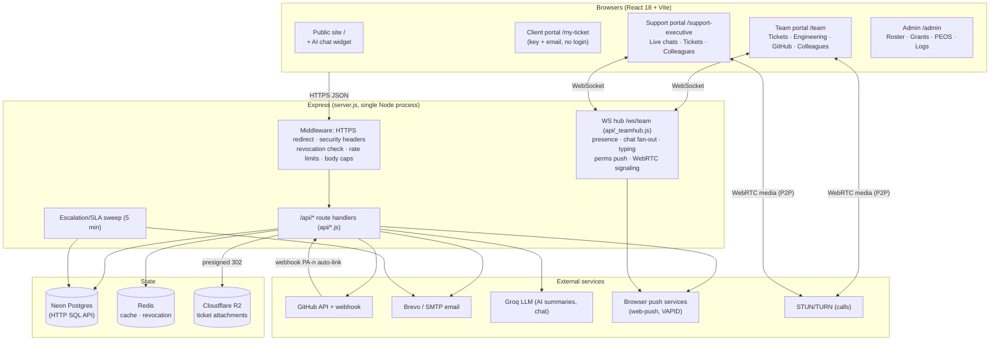
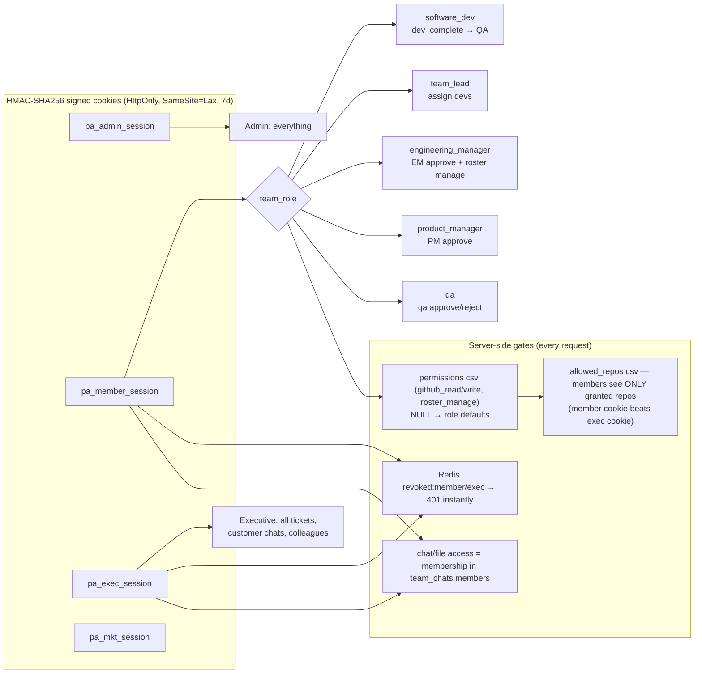
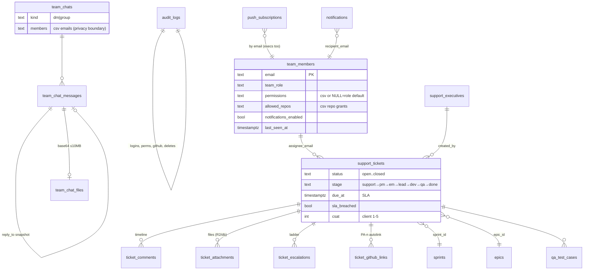
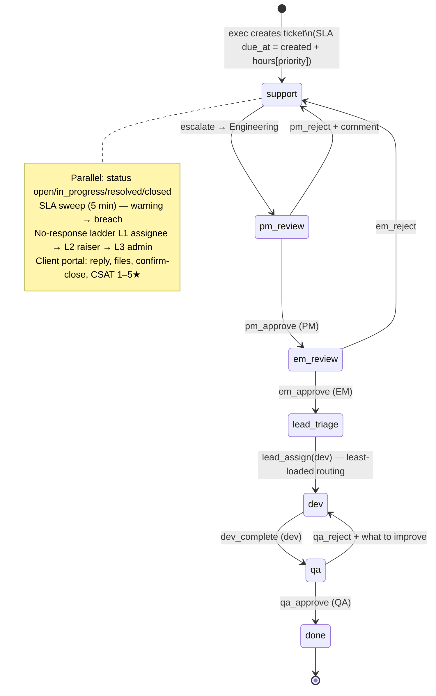
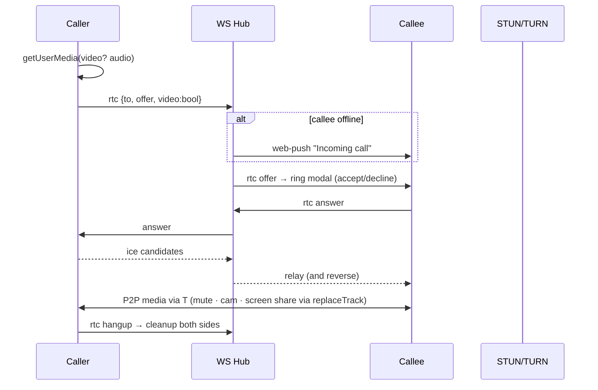
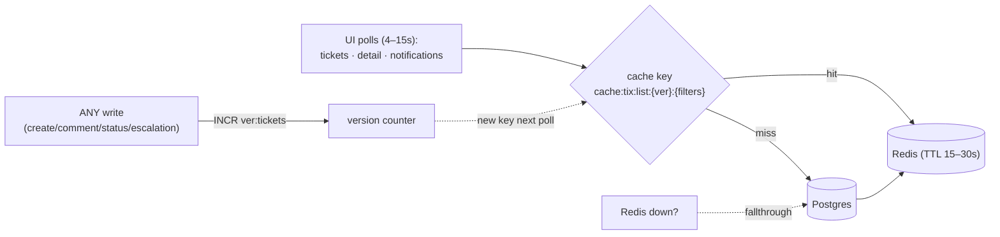
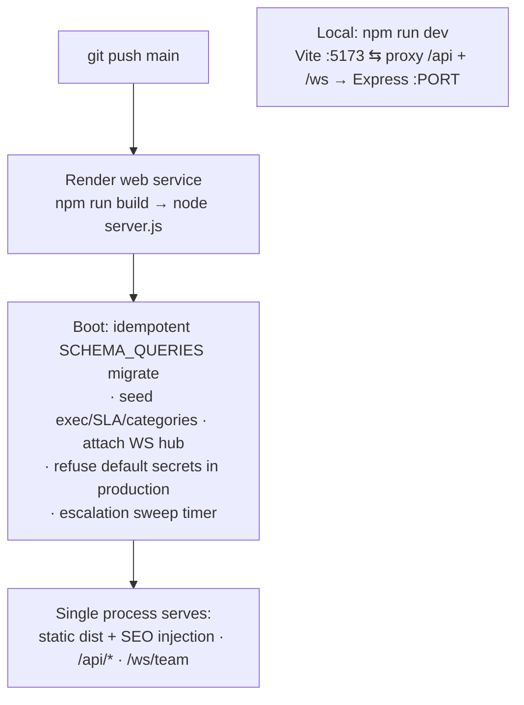

# PatienceAI Platform — Full Architecture (Mermaid)

All diagrams render on GitHub. Source of truth: `server.js`, `api/*`, `src/pages/*`, `src/components/*`.

## 1. System Overview



## 2. Sessions, Roles & Authorization



## 3. Data Model (core tables)



## 4. Ticket Lifecycle & Engineering Workflow



## 5. Colleagues Realtime (chat · presence · files)

```mermaid
sequenceDiagram
    participant A as Member/Exec A
    participant H as WS Hub (/ws/team)
    participant API as /api/colleagues
    participant PG as Postgres
    participant P as web-push

    A->>H: connect (cookie verified: member OR exec)
    H-->>A: presence snapshot {email: online|away|offline}
    Note over H: activity ping >10 min silent → away;<br/>disconnect → offline + last_seen_at write

    A->>API: POST send {chatId, message, replyTo?}
    API->>PG: INSERT team_chat_messages (reply snapshot)
    API->>H: broadcastToEmails(chat members)
    H-->>A: {type:chat, message} (all open tabs)
    API->>P: push to members w/o open socket<br/>(unless notifications_enabled=false)

    A->>API: POST /upload raw ≤10MB
    API->>PG: message + team_chat_files(base64)
    Note over API: GET ?file=id → membership check;<br/>html/svg ⇒ attachment+octet-stream (XSS guard)
```

## 6. Voice/Video Call Signaling (WebRTC)



## 7. Admin Grant Propagation & GitHub Gating

```mermaid
sequenceDiagram
    participant AD as Admin panel
    participant API as /api/team-members PATCH
    participant H as WS Hub
    participant U as Member portal (open tab)
    participant GH as /api/github

    AD->>API: {id, allowedRepos:[...]} (admin/EM only)
    API->>H: broadcastToEmails([member], perms_updated)
    H->>U: perms_updated → refetch /me + repos
    Note over U: GitHub tab + repo list update instantly;<br/>8s poll self-heals if WS missed;<br/>open revoked repo is cleared
    U->>GH: repos=1 / branches / PR actions
    GH-->>U: filtered to allowed_repos; non-granted → 403
```

## 8. Read Path — Redis Cache (why polling is cheap)



## 9. Deployment & Boot


